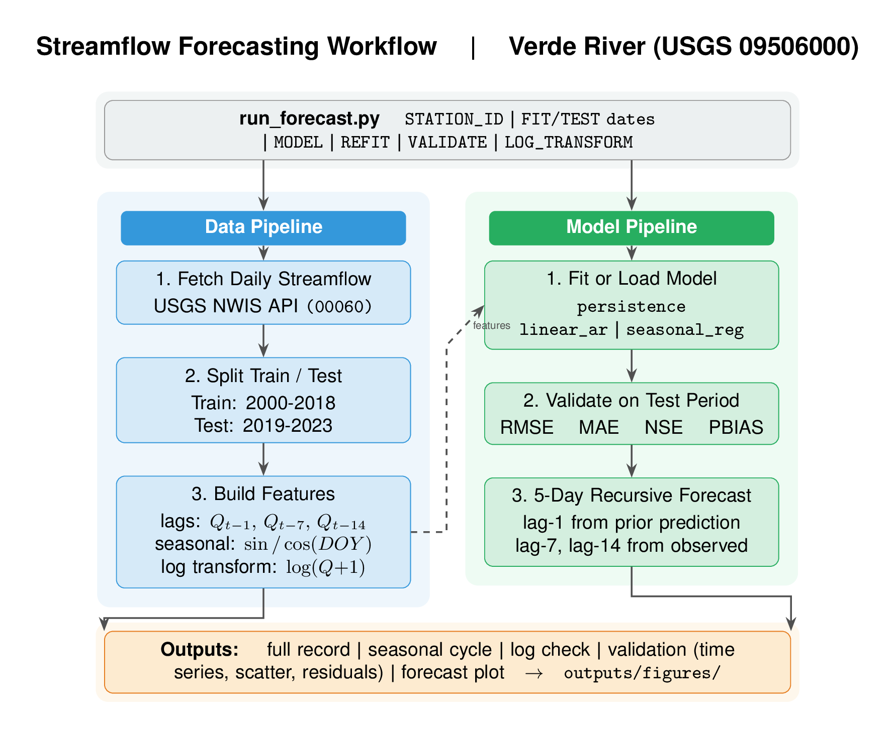

# HW7 Report: Streamflow Forecasting Workflow
HWRS 564B | Aamir

**GitHub Repo:** https://github.com/aamirlc/hw7-streamflow

## Exercise 3 Drawing



## Workflow Updates

I started from the class workflow (USGS.py) which just fetches data from the
USGS API and makes a time series plot. Here is what I added:

1. **Model fitting and saving.** The original script stopped at downloading the data.
   I added three model options with a training and testing split. Fitted model
   coefficients get saved to a JSON file so you can reload without retraining.

2. **Log transform.** I fit the models on log(Q+1) instead of raw Q. Streamflow is
   right-skewed so working in log space helps with variance and gives better predictions
   at low flows. The back-transform happens automatically before any metric or plot.

3. **Recursive multi-step forecast.** The class script just fetched and plotted
   historical data. I added the actual forecasting logic where each predicted day
   feeds into the next step as the lag-1 feature.

4. **Validation metrics and plots.** Added RMSE, MAE, NSE, and percent bias on the
   held-out test period. The validation figure has three panels: time series with
   test predictions, a predicted vs observed scatter, and a residual histogram.

5. **Seasonal cycle and distribution plots.** Monthly mean with std bars, and a
   side-by-side histogram showing why the log transform makes sense.

6. **User config at top.** All the options (station, date ranges, forecast start,
   model choice, refit flag) are just variables at the top of the script.

7. **environment.yml** so the environment is reproducible.

## New Model Added: Seasonal Regression

The two models from class were persistence (Q_forecast = Q_yesterday) and a simple
linear autoregression with lag-1 streamflow.

The model I added is a seasonal multiple regression using:
- Lagged streamflow at 1, 7, and 14 days back
- sin and cos of day-of-year at the annual and semi-annual periods

So the equation is:

```
log(Q+1)[t] = a1*log(Q+1)[t-1] + a2*log(Q+1)[t-7] + a3*log(Q+1)[t-14]
            + b1*sin(2pi*DOY/365) + b2*cos(2pi*DOY/365)
            + b3*sin(4pi*DOY/365) + b4*cos(4pi*DOY/365)
            + intercept
```

The Fourier terms work because you can approximate any periodic signal with sin/cos
pairs. The annual and semi-annual harmonics capture the winter baseflow, spring
snowmelt peak, and monsoon pattern. This is different from lag-1 linear AR because it
accounts for what time of year it is, not just what flow was yesterday. The 7-day and
14-day lags help with slower recession behavior after storms.

Still a linear regression fit with OLS, just with more features.

## Note on AI

Used AI, still read and edited a lot of it myself.

## Reflection Questions

**Are you happy with how your repo came out?**

For the most part yeah. The seasonal regression model works noticeably better than
the simple AR which is good to see. The config block at the top is clean and the
validation outputs are easy to read. If I was handing this to someone to run I would
feel okay about it.

**What was the most challenging aspect of this assignment and activities for you?**

Getting the recursive forecasting indexing right was annoying. You have to track which
lag values come from actual observed data and which come from your own previous
predictions. For a 5-day forecast the 7 and 14-day lags are always from real data
since you are only going 5 days out, but lag-1 flips to a model output starting on
day 2. Getting that correct took a while. Also the log transform adds a layer where
you have to be careful about when to transform and when to back-transform especially
inside the recursive loop.

**If you had more time, what would you have done differently?**

I would have tried a machine learning model like a random forest or LSTM to see if
it actually does better than the regression approach for this kind of forecast.

**How do you think your skills have progressed this semester?**

I came in with a decent background through my research so a lot of the Python side
was not new to me. But this class still helped fill in gaps I did not know I had.
The geospatial stuff especially, I had basically never worked with coordinate
reference systems or rasters before HW5 and that was genuinely new. The workflow
and reproducibility framing from this assignment is also something I had not thought
about much before. I mostly just had scripts that ran on my machine and called it
good.

**Are you happy with this progress or are there things you wished we had done more
or less of?**

Yeah for the most part. I wish we had touched on some machine learning since that
is where a lot of hydrology is going and I think it would have fit well with what
we did. But overall the class covered good ground.
